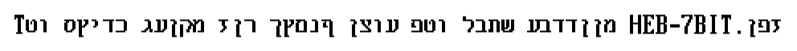
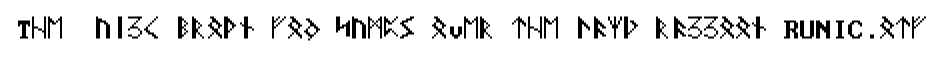
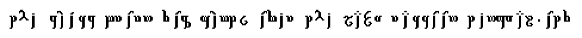
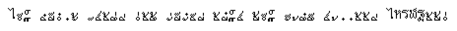

# DOS fonts converted to .otb

These are all [the fonts collected](https://github.com/viler-int10h/vga-text-mode-fonts) by [@VileR](https://github.com/viler-int10h) as .otb fonts; at least, the ones [bitmapfont2otb](https://github.com/ctrlcctrlv/bitmapfont2otb) could understand.

## Fonts

### 16_CYR.otf

### 16_GFX.otf

### 16_GRE.otf

### 16_HEB.otf

### 16_LT1.otf

### 16_LT2.otf

### 16.otf

### 16_RUS.otf

### 2_HEBREW.otf

### 32.otf

### 3DL-A8.otf

### 3DL-A9.otf

### 3DL-B.otf

### 40C-TYPE.otf

### 6X8.otf

### 8_CYR.otf

### 8_GFX.otf

### 8_GRE.otf

### 8_HEB.otf

### 8_LT1.otf

### 8_LT2.otf

### 8.otf

### 8_RUS.otf

### 8X8ITAL.otf

### 8X8.otf

### 8X8THIN.otf

### 9X16SNSF.otf

### A7100RU1.otf

### A7100RU2.otf

### A7100-US.otf

### ACER710D.otf

### ACER710.otf

### ACERGRCD.otf

### ACERGRC.otf

### ACERV8_D.otf

### ACERV8.otf

### ACERV9.otf

### ALT8_CYR.otf

### ALT8_GFX.otf

### ALT8_GRE.otf

### ALT8_HEB.otf

### ALT8_LT1.otf

### ALT8_LT2.otf

### ALT8.otf

### ALT8_RUS.otf

### AMBASSAD.otf

### AMIEGA8D.otf

### ANSIBLE.otf

### ANTIQUE.otf

### APC-III.otf

### APLS.otf

### APRI200D.otf

### APRI200.otf

### APRI-M.otf

### APRIPORT.otf

### ARMENIAN.otf

### ARMSCII8.otf

### ART.otf

### ARTX.otf

### AS-100.otf

### ASCII_HX.otf

### ATARIPOF.otf

### ATI8X16.otf

### ATI8X8_D.otf

### ATI8X8.otf

### ATI9X16.otf

### ATIKRVGA.otf

### ATISMLW6.otf

### ATISWGRD.otf

### ATISWGR.otf

### BACKSLNT.otf

### BAUHAUS.otf

### BBC512BD.otf

### BBC512B.otf

### BBC512_D.otf

### BBC512.otf

### BIGGER.otf

### BIGSERIF.otf

### BINARY.otf

### BIOS_D.otf

### BIOS.otf

### BIT8X16.otf

### BIT8X8.otf

### BLKBOARD.otf

### BLOODY.otf

### BODONI.otf

### BOLD0.otf

### BOLD1.otf

### BOLD2.otf

### BOLD3.otf

### BOLD4.otf

### BOLD5.otf

### BOXROUND.otf

### BRAILLE.otf

### BROADWY1.otf

### BROADWY2.otf

### BROADWY3.otf

### BRUSH.otf

### BULKY.otf

### CALCULAT.otf

### CGA_D.otf

### CGA.otf

### CGA-TH_D.otf

### CGA-TH.otf

### CHESSPT1.otf

### CHESSPT2.otf

### CHESSPT3.otf

### CIRCLE.otf

### CL5320-8.otf

### CL5320-9.otf

### CLPORT9.otf

### CM-5X8.otf

### CM-6X8.otf

### CNTDOWN.otf

### COMPAQP3.otf

### COMPAQTH.otf

### COMPIS.otf

### COMPUTR2.otf

### COMPUTR3.otf

### COND8X16.otf

### CONDBIT.otf

### COPAMX_D.otf

### COPAMX.otf

### CORRODED.otf

### COURIER1.otf

### CP1051.otf

### CP1116.otf

### CP1117.otf

### CP1118.otf

### CP1119.otf

### CP1124.otf

### CP1125.otf

### CP112.otf

### CP113.otf

### CP1250.otf

### CP1251.otf

### CP1252.otf

### CP1253.otf

### CP1254.otf

### CP1257.otf

### CP1275.otf

### CP1281.otf

### CP1283.otf

### CP1284.otf

### CP1285.otf

### CP1287.otf

### CP1288.otf

### CP30001.otf

### CP30002.otf

### CP30003.otf

### CP30004.otf

### CP30007.otf

### CP30010.otf

### CP30012.otf

### CP30013.otf

### CP30015.otf

### CP30016.otf

### CP30017.otf

### CP30018.otf

### CP30019.otf

### CP30021.otf

### CP30022.otf

### CP30023.otf

### CP30025.otf

### CP30027.otf

### CP30028.otf

### CP30029.otf

### CP30031.otf

### CP30032.otf

### CP30033.otf

### CP30034.otf

### CP30039.otf

### CP30040.otf

### CP3021.otf

### CP3845.otf

### CP3846.otf

### CP437ALT.otf

### CP437BGR.otf

### CP437.otf

### CP437_T.otf

### CP58152.otf

### CP58163.otf

### CP58210.otf

### CP58222.otf

### CP58258.otf

### CP58335.otf

### CP58595.otf

### CP58598.otf

### CP58601.otf

### CP58627.otf

### CP58630.otf

### CP59187.otf

### CP59246.otf

### CP59283.otf

### CP59619.otf

### CP59620.otf

### CP59829.otf

### CP60211.otf

### CP60258.otf

### CP60270.otf

### CP60643.otf

### CP61235.otf

### CP61294.otf

### CP61667.otf

### CP62259.otf

### CP62306.otf

### CP62318.otf

### CP62691.otf

### CP63342.otf

### CP65500.otf

### CP65501.otf

### CP65502.otf

### CP65503.otf

### CP65504.otf

### CP65505.otf

### CP65506.otf

### CP667.otf

### CP668.otf

### CP737.otf

### CP770.otf

### CP771.otf

### CP772.otf

### CP773.otf

### CP774.otf

### CP775.otf

### CP777.otf

### CP778.otf

### CP790.otf

### CP808.otf

### CP819.otf

### CP848.otf

### CP849.otf

### CP850.otf

### CP850_T.otf

### CP851.otf

### CP853.otf

### CP855.otf

### CP856.otf

### CP857.otf

### CP858.otf

### CP859.otf

### CP860.otf

### CP862.otf

### CP863.otf

### CP865.otf

### CP865_T.otf

### CP866B.otf

### CP866C.otf

### CP866.otf

### CP866U.otf

### CP872.otf

### CP881.otf

### CP882.otf

### CP883.otf

### CP884.otf

### CP885.otf

### CP895.otf

### CP899.otf

### CP901.otf

### CP902.otf

### CP912.otf

### CP913.otf

### CP914.otf

### CP915.otf

### CP920.otf

### CP921.otf

### C&T-HIQV.otf

### CYRIL_B.otf

### CYRILL1.otf

### CYRILL2.otf

### CYRILL3.otf

### CYRILLI2.otf

### CYRILLI3.otf

### CYRILLIC.otf

### DECORATE.otf

### DEF_8X16.otf

### DEF_8X8.otf

### DG1ALT_D.otf

### DG1ALT.otf

### DG1_D.otf

### DG1.otf

### DKY#001.otf

### DONNA.otf

### DOSV-437.otf

### DTK8X8_D.otf

### DTK8X8.otf

### EAGLE1_D.otf

### EAGLE1.otf

### EAGLE2_D.otf

### EAGLE2.otf

### EAGLE3_D.otf

### EAGLE3.otf

### ELEGANT2.otf

### ELEGANTE.otf

### ELEGITAL.otf

### ELERGON.otf

### EPSONQ1D.otf

### EPSONQ1.otf

### EPSONQ2D.otf

### EPSONQ2.otf

### ESCHATON.otf

### EUCGA_D.otf

### EUCGA.otf

### EUCGAT_D.otf

### EUCGAT.otf

### EUROPC_D.otf

### EUROPC.otf

### EVXME132.otf

### EVXME94.otf

### EVXMEEGA.otf

### FANTASY.otf

### FANT_CYR.otf

### FANT_GFX.otf

### FANT_GRE.otf

### FANT_HEB.otf

### FANT_LT1.otf

### FANT_LT2.otf

### FANT.otf

### FANT_RUS.otf

### FATSCII.otf

### FE_8X16.otf

### FE_8X8.otf

### FLORI.otf

### FM-T-437.otf

### FM-TOWNS.otf

### FONTHE8.otf

### FONTHE.otf

### FUTURA.otf

### GOTHIC2.otf

### GOTHIC.otf

### GOTH_NEW.otf

### GRCKSSRF.otf

### GR-CP437.otf

### GR-CP850.otf

### GREEKALT.otf

### GREEK.otf

### HACK4TH.otf

### HAIK8.otf

### HANDUGLY.otf

### HANDWRIT.otf

### HBRW1987.otf

### HEB-7BIT.otf

### HEBBOLDK.otf

### HEB-BOLD.otf

### HEBCLRGF.otf

### HEBIBM83.otf

### HEBKTAV1.otf

### HEBKTAV2.otf

### HEBLARGE.otf

### HEBREW.otf

### HEBUGLY.otf

### HEBYOGI.otf

### HERCITAL.otf

### HP-LX6CF.otf

### HP-LX6L1.otf

### HP-LX6L2.otf

### HP-LX6NO.otf

### HP-LX6.otf

### HP-LX6PT.otf

### HP-LX8CF.otf

### HP-LX8L1.otf

### HP-LX8L2.otf

### HP-LX8NO.otf

### HP-LX8.otf

### HP-LX8PT.otf

### HUGE.otf

### HUGE-VGA.otf

### IBMCGA83.otf

### IGSVGA8.otf

### IGSVGA9.otf

### INTELV8.otf

### INTELV9.otf

### INVASION.otf

### ISO01_T.otf

### ISO02.otf

### ISO04.otf

### ISO04V9.otf

### ISO04V9W.otf

### ISO04_W.otf

### ISO05.otf

### ISO07.otf

### ISO08.otf

### ISO09.otf

### ISO15.otf

### ISO15_T.otf

### ISOCP437.otf

### ISOCP850.otf

### ISOCP852.otf

### ISOCP855.otf

### ISOCP857.otf

### ISOCP860.otf

### ISOCP861.otf

### ISOCP863.otf

### ISOCP866.otf

### ISOCP869.otf

### ISO.otf

### ITALIC2.otf

### ITALIC3.otf

### ITTX_D.otf

### ITTXNW_D.otf

### ITTXNW.otf

### ITTX.otf

### JAT-MC_D.otf

### JAT-MC.otf

### JAT-RMCD.otf

### JAT-RMC.otf

### JULIE2.otf

### JULIE.otf

### KANA.otf

### KAYPRO10.otf

### KEWL.otf

### KOI8-RB.otf

### KOI8-RC.otf

### KOI8-R.otf

### KOI8-U.otf

### KOOL.otf

### KPRO2K_D.otf

### KPRO2K.otf

### KR-DOS.otf

### LB_LARGE.otf

### LB_OCR.otf

### LBPC_D.otf

### LBPC.otf

### LE-D_D.otf

### LE-D.otf

### LEGEND.otf

### LOADHEB.otf

### MACNTOSH.otf

### MAC.otf

### MBC16B_D.otf

### MBC16B.otf

### MBC55X_D.otf

### MBC55X.otf

### MBC775_D.otf

### MBC775.otf

### MBPC230D.otf

### MBPC230.otf

### MCR_CYR.otf

### MCR_GFX.otf

### MCR_GRE.otf

### MCR_HEB.otf

### MCR_LT1.otf

### MCR_LT2.otf

### MCR.otf

### MCR_RUS.otf

### MERP2.otf

### MERP3.otf

### MERP.otf

### MINDSETD.otf

### MINDSET.otf

### MINI.otf

### MODERN.otf

### MORSE.otf

### MPACT_D.otf

### MPACT.otf

### MTGRC1_D.otf

### MTGRC1.otf

### MTGRC2_D.otf

### MTGRC2.otf

### MTGRC3_D.otf

### MTGRC3.otf

### MTGRC4_D.otf

### MTGRC4.otf

### MTGRC5_D.otf

### MTGRC5.otf

### MTGRC6_D.otf

### MTGRC6.otf

### MTGRC7_D.otf

### MTGRC7.otf

### MTGRC8_D.otf

### MTGRC8.otf

### MTGRC9_D.otf

### MTGRC9.otf

### NEC-MS1A.otf

### NEC-MS1B.otf

### NEC-MS2A.otf

### NEC-MS2B.otf

### NICER40C.otf

### NIX-M15A.otf

### NIX-M15B.otf

### NIX-M16.otf

### NIX-M35D.otf

### NIX-M35.otf

### NORTON0.otf

### NORTON1.otf

### NUTSO.otf

### OLDENG-F.otf

### OLI-D-T8.otf

### OLI-D-T9.otf

### OLIPC1EU.otf

### OLIPC1GR.otf

### OLIPC1HE.otf

### OLIPC1TT.otf

### OLIVGR_D.otf

### OLIVGR.otf

### OLIVM15D.otf

### OLIVM15.otf

### ORATOR.otf

### PARKAVE.otf

### PC1640AD.otf

### PC1640A.otf

### PC1640BD.otf

### PC1640B.otf

### PC1640CD.otf

### PC1640C.otf

### PC1640DD.otf

### PC1640D.otf

### PC6300.otf

### PCCONV_D.otf

### PCCONV.otf

### PEKIGORD.otf

### PERCY.otf

### PGC.otf

### PHXBIOSD.otf

### PHXBIOS.otf

### PHXEGA8D.otf

### PHXEGA8.otf

### PHXVGA8.otf

### POLICE.otf

### PPC1_D.otf

### PPC1.otf

### PPC2_D.otf

### PPC2.otf

### PPC3_D.otf

### PPC3.otf

### PPC4_D.otf

### PPC4.otf

### PP_ROMAN.otf

### PP_SSER.otf

### PS2OLD8.otf

### PS2OLD9.otf

### PS2THIN1.otf

### PS2THIN2.otf

### PS2THIN3.otf

### PS2THIN4.otf

### PVBGC1_D.otf

### PVBGC1.otf

### PVBGC2_D.otf

### PVBGC2.otf

### PVBGC3_D.otf

### PVBGC3.otf

### PVGAP132.otf

### READABL7.otf

### READABL8.otf

### REZPOUET.otf

### ROM8PIX.otf

### ROMAN3.otf

### ROMAN.otf

### ROMANY.otf

### ROTUND.otf

### RUGENC1D.otf

### RUGENC1.otf

### RUGENC2D.otf

### RUGENC2.otf

### RUMG1C_D.otf

### RUMG1C.otf

### RUMG2C_D.otf

### RUMG2C.otf

### RUNES.otf

### RUNIC.otf

### RUS_AR1.otf

### RUS_AR6E.otf

### RUS_AR6.otf

### RUS_ARE.otf

### RUS_AR.otf

### SANSERIX.otf

### SANSF1.otf

### SCRAWL2.otf

### SCRAWL.otf

### SCRIPT3.otf

### SCRIPT4.otf

### SCRWL---.otf

### SCRWL~~~.otf

### SEEQUA_D.otf

### SEEQUA.otf

### SERIFBIG.otf

### SHARP3K1.otf

### SHARP3K2.otf

### SIGRM8.otf

### SIMPAGAR.otf

### SIMPLE.otf

### SM910_D.otf

### SM910.otf

### SMEGA88.otf

### SMOOTH.otf

### SMVGA88.otf

### SMVGA.otf

### SPERRY_D.otf

### SPERRYHI.otf

### SPERRY.otf

### SPRANTO1.otf

### SPRANTO2.otf

### SUBSUP.otf

### SWIS1131.otf

### SWIS1251.otf

### SWISSAV2.otf

### SWISS-AV.otf

### SWISSBOX.otf

### SWISSBX2.otf

### SWISS.otf

### SYS8X16.otf

### T3100-A1.otf

### T3100-A2.otf

### T3100-A3.otf

### T3100-A4.otf

### T3100-B1.otf

### T3100-B2.otf

### T3100-B3.otf

### T3100-B4.otf

### TALL_CYR.otf

### TALL_GFX.otf

### TALL_GRE.otf

### TALL_HEB.otf

### TALL_LT1.otf

### TALL_LT2.otf

### TALL.otf

### TALL_RUS.otf

### TANDY2K1.otf

### TANDY2K2.otf

### TENGWAR.otf

### TEX-MATH.otf

### THAI.otf

### TH-CP437.otf

### TH-CP850.otf

### TH-CP852.otf

### TH-CP860.otf

### TH-CP865.otf

### THIN8X8.otf

### THIN_CYR.otf

### THIN_GFX.otf

### THIN_GRE.otf

### THIN_HEB.otf

### THIN_LT1.otf

### THIN_LT2.otf

### THIN.otf

### THIN_RUS.otf

### THIN_SS.otf

### TINYTYPE.otf

### TOSH-SAT.otf

### TOSHT300.otf

### TRI88CS8.otf

### TRI88CS9.otf

### TRIVGA8.otf

### VERITE_D.otf

### VGA8.otf

### VGA9.otf

### VGAHEB92.otf

### VGA-ROM.otf

### VOYNICH.otf

### VTECH_D.otf

### VTECH.otf

### WACKY2.otf

### WACKY.otf

### WANG437M.otf

### WANGPCMD.otf

### WIGGLY.otf

### WVGA8_D.otf

### WVGA8.otf

### YIDDISH.otf

### Z_RUSS.otf

